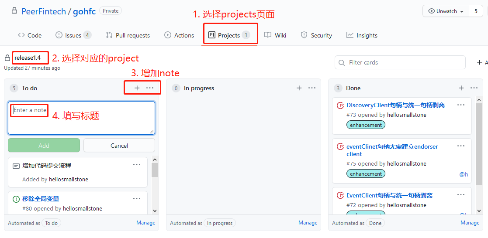
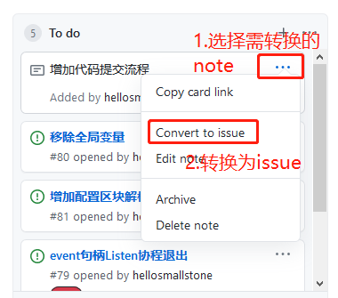
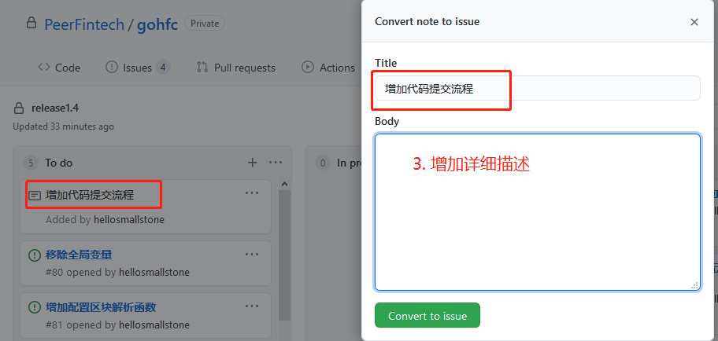
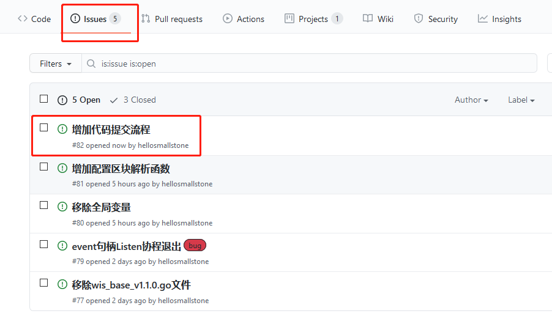
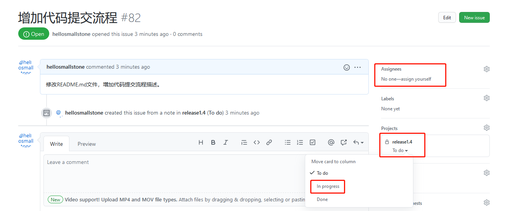
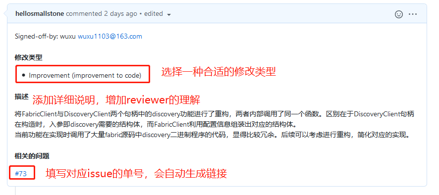

# gosdk - Golang Hyperledger Fabric Client

这是使用纯Golang编写的Hyperledger Fabric的SDK。这不是官方的SDK，也不遵循Hyperledger团队提供的官方SDK API准则。有关官方SDK的列表，请参考官方Hyperledger文档。

它被设计为易于使用且速度最快。目前，它的性能远远超过了官方的Go SDK。此版本将得到更新和支持，因此非常欢迎提出请求和报告任何问题。

推荐的Go版本 >=1.14

此SDK已针对Hyperledger Fabric 1.4.x以及2.2.x进行了测试。

## 安装

```
go get -u github.com/PeerFintech/gosdk

```

## 基本概念

gosdk提供了一个高级客户端，用于处理block，ledger，chaincode，channel和event的高级API。

一般流程是这样的：

- 使用docker-compose或任何其他适合您的工具启动Fabric。运行Fabric不是gosdk的责任。
- 使用`gosdk.NewFabricClient`，初始化gosdk
- 使用`CreateUpdateChannel`，通过将channel配置发送给orderer来创建channel。
- 使用`JoinChannel`，将peer加入channel。
- 使用`InstallChainCode`，在一个或多个peer节点中安装一个或多个链码。
- 使用`InstantiateChainCode`，实例化一个或多个已经安装的chaincode。
- 使用查询查询chaincode：`Query`。这是只读操作。不会对区块链或ledger进行任何更改。
- 使用调用chaincode：`Invoke`。该操作可以更新区块链和ledger。
- 使用`gosdk.ListenForFullBlock`或`gosdk.ListenForFilteredBlock`收听事件
- 还有更多的方法来获取特定的block，discover功能等。

### 关于MSPID
Fabric中的每个对等方和订购者都必须具有一组加密材料，例如根CA证书，中间证书，吊销证书列表等等。这组证书与ID关联，此ID称为MSP（成员服务提供商）。在每个操作中，都必须提供MSPID，以便对等方和订购者知道要加载并用于验证请求的加密材料集。

通常，MSP定义组织和组织内部具有角色的实体。几个MSP合并组成一个联盟，因此多个组织（每个组织都有自己的一组证书）可以一起工作。

因此，当发送对Fabric的任何请求时，此请求必须由Ecert签名（用户证书保留在中`gosdk.Identity`），并且必须提供MSPID，以便Fabric通过ID加载MSP，并验证此请求来自组织成员并且该成员具有适当的访问权限。

```

gosdk初始化：

```
c1, err := gosdk.NewFabricClient(&org1ClientConfig)
if err != nil {
    fmt.Printf("Error loading file: %v", err)
	os.Exit(1)
}

```

### 安装 chaincode

安装新的链码时，`gosdk.InstallRequest`必须提供一个类型为struct的结构：

```

installRequest := &gosdk.InstallRequest{
	ChannelId:        channelName,
	ChainCodeName:    chaincodeName,
	ChainCodeVersion: "1.0",
	ChainCodeType:    gosdk.ChaincodeSpec_GOLANG,
	Namespace:        "github.com/PeerFintech/gosdk/test/fixtures/chaincode",
	SrcPath:          chaincodePath,
}
```

Fabric将支持用不同语言编写的链码，因此必须使用`ChainCodeType`--gosdk指定语言类型。现在仅支持Go。其他代码语言将在以后添加。

`ChannelId` 是安装chaincode的通道名称。

`ChainCodeName` 是chaincode的名称。此名称将在以后的请求（查询，调用等）中使用，以指定必须执行的链码。一个频道可以有多个链码。名称在频道的上下文中必须是唯一的。

`ChainCodeVersion` 指定版本。

gosdk设计为无需Go环境即可工作。因此，当用户尝试安装chaincode时必须提供`Namespace`,`SrcPath` and `Libraries`（可选）

`Namespace` 是Go命名空间，它将在Fabric运行时中"install"chaincode。比如 `github.com/some/code`

`SrcPath` 是源代码所在的绝对路径，为打包安装做准备。 

这种分离使gosdk可以在没有任何外部运行时依赖项的情况下运行。

`Libraries` 是链表打包中将包含的库的可选列表。遵循`Namespace`和`SrcPath`同样的逻辑。

## Development Process
当前gosdk项目由两地团队进行共同维护开发，为提高开发效率与质量，需借助项目管理工具进行任务管理，同时需遵守相应的流程。当前采用github的Projects和Issues功能来跟踪对应的任务与进度。实际开发过程中的具体流程如下：  
1) 增加note  
在Projects界面中选择对应的project后，在对应的"To do"列表中点击“+”号增加，此处只需填写标题。  

2) 转换issue  
刚增加的note只有标题，需将其转换为issue，并增加详细描述。转换为issue后，在Issues页面将可看到该问题。  



3) issue认领与启动  
在解决问题前，需将此issue分配到自己名下，并将状态改为“In progress"，表明该issue已开始处理。  

4) 提交代码与pr  
现阶段主分支已被保护，不可直接提交代码，所有的代码修改均需通过pr合并来进入对应的分支仓库。在提交pr时，需在信息中添加对应的修改类型、解决描述以及问题编号，以便reviewer通过此类信息详细了解问题，增加review效率。pr生成后会自动触发CI流程，若CI出现错误，需及时修改代码并再次提交。待CI流程通过后，pr提交者可在pr页面邀请同事进行代码review。  

5) review代码  
只有通过CI测试的pr才会进入review阶段。reviewer若发现代码问题，可添加相应的comments，要求提交者进行修改，直至所有问题都解决，才可approve pr，并合入代码。  
6) issue关闭  
当代码合入后，确定对应的issue已解决，需在issue页面将对应的状态修改为"Done"，同时关闭该issue。同时在Projects页面中，对应的note也会自动移动至”Done"列表。  
如果一个pr无法解决该issue，则需再次提交新的pr进行解决，直至所有问题确认解决后，才可关闭该issue。  

## TODO
- 简单的相互TLS认证

- ... ...


### 可用的加密算法

| Family   | Algorithm   | Description                                      | 
|:--------:|:-----------:|--------------------------------------------------| 
| ecdsa    | P256-SHA256 | Elliptic curve is P256 and signature uses SHA256 |
| ecdsa    | P384-SHA384 | Elliptic curve is P384 and signature uses SHA384 |
| ecdsa    | P521-SHA512 | Elliptic curve is P521 and signature uses SHA512 |
| rsa      | ----        | RSA is not supported in Fabric                   |
| SM       | P256SM2     | gosdk支持国密算法                                |

### Hash

| Family    | 
|:----------| 
| SHA2-256  |
| SHA2-384  |
| SHA3-256  |
| SHA3-384  |
| SM3       |
